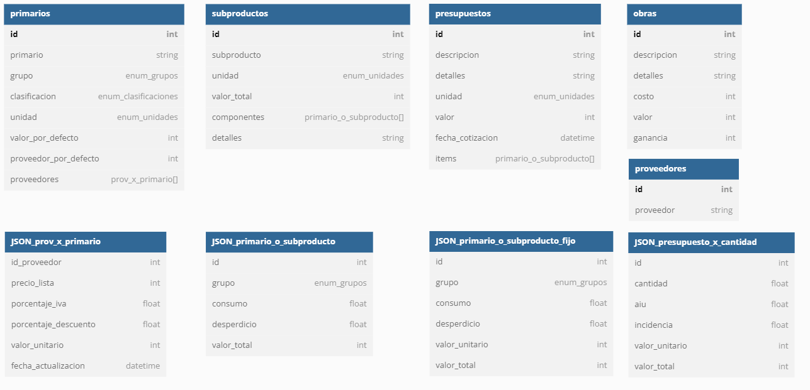

# **Software construcción**

CRUD para constructoras, para llevar registro de los materiales y gastos que se utilizan en obras. Actualmente se encuentra en desarrollo.

El diseño en Figma con las vistas de la aplicación se encuentra en el siguiente enlace: [Figma](https://www.figma.com/file/YcHWRR9Zoxoxxyfg4brPlt/Dise%C3%B1o-app-construcci%C3%B3n?node-id=0%3A1&t=eHYX4BpW0ghK3as1-1)

Actualmente se encuentran finalizadas todas las vistas del flujo de "Primarios".

---

## **Stack de desarrollo**

Para desarrollar aplicación, estaré usando el stack MEAN (Mongo Express Angular Node.js)

---

## **Esquema de base de datos**

Al estar usando MongoDB, la base de datos es de tipo no relacional, no obstante, en la siguiente imagen se evidencian los modelos de datos que se utilizarán en el desarrollo de la aplicación 

